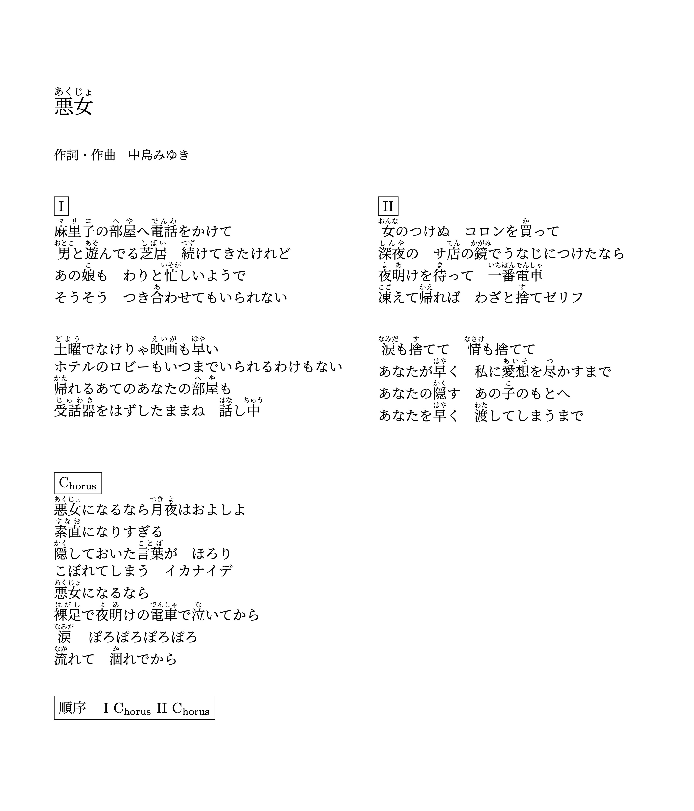

# 悪女

> 
可当那些沉默的女人扯开喉咙，发出并不像人们期待中那样优美婉转的声音时，她们的呐喊却同疯子的呓语一样被这个世界无视。

>
> 
——甯蘅

《**悪女**》是**中岛美雪**的代表歌曲之一。自从开始听美雪的歌起，我就注意到了这一首歌；并且一直以来，我都十分喜欢这首歌。一开始是被《**寒水鱼**》版中**後藤次利**的明快的编曲、以及美雪独特的演唱风格所吸引；慢慢地，当我最近开始更仔细地研究这首歌的歌词时，我又一次地获得了初听时的惊喜。
$$
《悪女》是中岛美雪于1981年发行的第十一张单曲，由中岛美雪本人作词作曲，自发行以来就大获成功。王菲曾翻唱其粤语填词版《**若你真爱我**》，收录于名专《**十万个为什么**》中。而日本本土歌手如中森明菜和当然，美雪演唱的版本，也是分为了三个：单曲版（**船山基紀** 编曲）、《寒水鱼》版（**後藤次利** 编曲）和《歌暦》版（**椎名和夫** 编曲），足以看出其实在饱受欢迎。

美雪是擅长写情歌的，而这当中失恋的情歌更是在多数。此前，有上一大碟《**臨月**》（临产月）中的《**ひとり上手**》（习惯孤独）；之后，有紧接着的《**予感**》（预感）里的《**夏土產**》（夏日特产）…… 这些都是一贯的有着细致而深切情感的苦情歌。但可以明显地看出，《悪女》这首歌，是与这些情歌不尽相同的。它虽然也站在女性视角去写恋爱中的苦痛，但换了一种新的表达方式，以一种全新的面貌出现在听众面前，这也让这首歌传达出的情感有了微妙的转变。在后期的采访中，美雪就曾说道：“**那段时间，当演唱会快结束时，开始流行大家站起来一起随着节拍鼓掌。不过，对于我的歌来说，比如《わかれうた》（别离之歌），要大家打拍子就有点不太合适。但这张专辑里的《恶女》，就可以了。大家可以一起拍拍手，还蛮不错的。**“（「月刊カドカワ」／1991年11月号） 此外，《**寒水鱼**》版更是加入了摇滚的色彩，在曲风上更是让人耳目一新。据美雪回忆道，这也是1984年左右开始的音乐试错时代的标志，即所谓的“**疯狂时代**”（**ご乱心の時代**，这一阶段美雪做了很多风格上的尝试和突破）。

自不必说，《悪女》的旋律是美的。单曲版的编曲简洁，用吉他作底色，键盘细勾边，便很自然地绘出了旋律。这样编排的单曲在早期面向大众时，由于其旋律本身的优秀，是很容易抓住听众的耳朵的，也能够给听众留下足够的记忆点。而**後藤次利**编排的大碟版，虽然可能抱有先入为主的偏见，但个人认为还是最耐听的一版。先用鼓和吉他简明交代了前奏，为主旋律做足铺垫，同时也为下文的行进留够空间。在这一版中，旋律的展现有所保留，取而代之的，则是以讲述和演绎的方式，把故事放在了主体。

《悪女》的故事，是简单而常见的，时时刻刻令人不觉地上演着。那，美雪是怎样把这一个故事讲出了“新意”呢？问题就在于故事中这一女子的主体性上。

许多美雪作品里的女子，初看似乎总是置身于相对弱势与困难的境地，然而她们并不会陷入传统女性的自怨自哀当中，而是在骨子里就怀有一种不甘，进而愈来愈演化为一股反抗的向上的冲劲。《悪女》就体现了这样的一种面貌，其后的《ファイト！》（加油！）和《孤独の肖像》（孤独的肖像）当中同样有所展现。

::: tip 歌词原文（已标注平假名）

:::

::: details 中文翻译（仅供参考）

:::