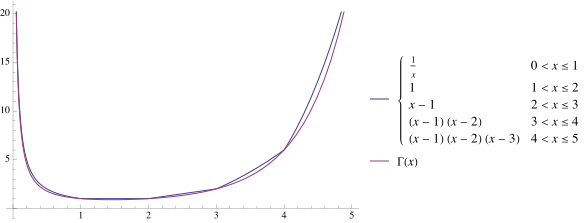

# Gamma函数的唯一性

$\Gamma$ 函数是数学中延拓思维的代表，同时也在数学分析、概率论及组合数学中有着广泛的应用。本文就将简单引入并介绍这一函数，并给出一个十分优美的定理——它表明了只需三个简单的条件，就可以断言满足条件的函数就是 $\Gamma$ 函数。这一定理充分体现出 $\Gamma$ 函数自然而又独特的美。

在小学时，我们可能听说过高斯 $(\mathrm{Johann~Carl~Friedrich ~Gauß})$ $10$ 岁时巧算的故事，主要是下面这一等式
 
$$1+2+3+\cdots +100=5050$$
 
这可以看成对最简单的等差数列——正整数列进行求和。高斯通过交换求和的计算顺序，巧妙地完成了这一题目。那么，如果把上式中的加号全部改为乘号，也就是说对正整数列进行求积，就会引出数学中另一个重要的概念——**阶乘**。
 
比如说 $1\cdot 2 \cdot 3 \cdot 4 \cdot 5 = 120$，我们称它为 $5$ 的阶乘，并用符号“$!$”来简记为 $5!$。这样一来，我们可以很简单地定义出所有正整数的阶乘：
 
$$ n! := n \cdot (n-1)!, \quad n \ge 1$$
 
特别地，为了使整个定义完整而有意义，我们规定 $0!=1$。
 
::: tip 阶乘的应用
阶乘最基础的应用可能就是在排列组合方面了。比方说，要从 $2n$ 个不同的人中选 $n$ 个人来参加绘画比赛，总共有多少种不同的选法？一个简单的想法是先选第一个人，此时有 $2n$ 种选择；选定后再选第二个人，此时由于有一人已选中，那么只有 $2n-1$ 种选择……以此类推，那么由乘法原理可见最终的选法总数有 $2n \cdot (2n-1) \cdot (2n-2) \cdots (n+1)$ 种，借助上面的阶乘定义，这一结果可以形式化地表示为
$\frac{(2n)!}{n!}$
 
于是我们就可以按此思想，用阶乘定义出排列数与组合数，来解决一系列排列组合的问题。此外，阶乘在幂级数、二项分布，及计算机科学中的时间复杂度分析都有着重要作用。
:::
 
到这里，一个良定义的实用概念就这样诞生了。这是在研究数学问题时合理抽象得出的结果。但是数学家们可不满足于此。早在$18$世纪，伯努利 $(\mathrm{Daniel~Bernoulli})$ 和哥德巴赫 $(\mathrm{Christian~Goldbach})$ 就思考了对阶乘的插值问题，也就是实数的阶乘问题，比如$(2.5)!$。如何去定义那些数轴上的非整点呢？欧拉 $(\mathrm{Leonard~Euler})$ $1730$ 年在一封寄给哥德巴赫的信中给出了一份合理的答案

$$\Gamma(x):= \int _{0}^{1}(-\ln(t))^{x-1}\mathrm{d}t$$
 
可以看出，此时对于 $n$ 而言，已经在正实数域上得到了定义。这也是 $\Gamma$ 函数的雏形之一。经过简单的换元，就可以得到下面这一最经典的定义。
 
目前广泛使用的 $\Gamma$ 函数定义是由勒让德 $(\mathrm{Adrien-Marie ~Legendre})$ 提出的，记号 $\Gamma(x)$ 也是由他一并提出的。这一定义可以在大多数微积分或数学分析课本上找到，即：

$$\Gamma(x):= \int _{0}^{+\infty}t^{x-1}\mathrm{e}^{-t}\mathrm{d}t$$
 
下面我们从此定义出发，简单介绍一下 $\Gamma$ 函数的基本性质。由于我们讨论的是阶乘的实数延拓，所以并不考虑 $\Gamma$ 函数在整个复数域上的定义。
 
首先来考虑其定义域。将其改写为
 
$$\int _{0}^{+\infty}t^{x-1}\mathrm{e}^{-t}\mathrm{d}t=\int _{0}^{1}t^{x-1}\mathrm{e}^{-t}\mathrm{d}t+\int _{1}^{+\infty}t^{x-1}\mathrm{e}^{-t}\mathrm{d}t$$
 
可见，当 $x \le 0$ 时，上式右端第一部分发散；当 $x > 0$ 时，上式均收敛（为什么？）。所以其定义域为 $x>0$。
 
再来考虑其连续性。对于 $x_{0}>0$，取 $0 < a\le x_{0}\le b$，
注意到

$$\left | t^{x_{0}-1}\mathrm{e}^{-t} \right | \le t^{a-1}\mathrm{e}^{-t},\quad t \in (0,1]$$
$$\left | t^{x_{0}-1}\mathrm{e}^{-t} \right | \le t^{b-1}\mathrm{e}^{-t},\quad t \in (1,+\infty)$$
 
上式右端的两个对 $t$ 的广义积分均收敛，由 $\mathrm{Weierstrass~M-test}$ 可得 $\Gamma(x_{0})$ 关于 $x_{0}\in [a,b]$ 一致收敛。利用含参变量广义积分一致收敛性的推论以及 $x_{0}$ 的任意性可知 $\Gamma(x)$ 在正实数域上连续。
 
下面来推导 $\Gamma$ 函数最重要的性质之一。这一性质说明了它是阶乘在实数域上的延拓。
 
由分部积分法可得

$$\Gamma(x+1)=\int _{0}^{+\infty}t^{x}\mathrm{e}^{-t}\mathrm{d}t=-\int _{0}^{+\infty}t^{x}\mathrm{d}(\mathrm{e}^{-t})$$
 
$$=-\left [ t^{x}{\mathrm{e}}^{-t}|_{0}^{+\infty} - \int_{0}^{+\infty}x t^{x-1}\mathrm{e}^{-t}\mathrm{d}t \right ]$$
 
$$=x\int_{0}^{+\infty} t^{x-1}\mathrm{e}^{-t}\mathrm{d}t=x\Gamma (x)$$
 
以及
 
$$\Gamma(1) = \int_{0}^{+\infty} \mathrm{e}^{-t} \mathrm{d}t = -\mathrm{e}^{-t}|_{0}^{+\infty}=1$$
 
对比阶乘的定义，由归纳法不难得出
 
$$\Gamma (n) = (n-1)! ,\quad n \in \mathbb{Z}^{+}$$
 
而关键在于，$\Gamma(x+1)=x\Gamma(x)$ 这一性质在正实数域上始终成立，这就把阶乘的性质完美复刻到了正实数域上。
 
大致介绍完 $\Gamma$ 函数的基本性质后，我们来关注这样一个问题：为什么 $\Gamma$ 函数如此独特？还有没有其他更合理的对于阶乘的延拓呢？下面来介绍今天的主角—— $\mathrm{Bohr–Mollerup}$ 定理。就像开头所说，这一定理将 $\Gamma$ 函数的三个简单的性质提炼出来，并断言仅需这三个条件就可以确定 $\Gamma$ 函数。
 
::: tip **$\mathrm{Bohr–Mollerup}$ 定理**
已知 $f(x)$ 是定义在 $(0,+\infty)$ 的正值函数，且满足：
- $f(1)=1$；
 
- 对于 $\forall ~ x >0$，有 $f(x+1)=x\cdot f(x)$；
 
- $\ln{f(x)}$ 在 $(0,+\infty)$ 上是凸函数。
 
则 $f(x)=\Gamma(x)$.
:::
 
这一定理是出人意料的。不过，在证明该定理之前，我们应该先验证 $\ln{\Gamma(x)}$ 是凸的。在某一区间上所谓的凸函数，可以直观理解为它具有在此区间内于函数图像上任取两点连成的线段始终高于该函数图像的性质。
 

::: tip 对数凸性
**定理** $\ln{\Gamma(x)}$ 在 $(0,+\infty)$ 上是凸函数。
 
**证明** 根据凸函数的性质以及 $\ln{\Gamma(x)}$ 的连续性可见，只需证明
 
$$\ln{\left[\Gamma \left (\frac{x_1+x_2}{2} \right ) \right ]}\le \frac{\ln{\Gamma(x_1)}+\ln{\Gamma(x_2)}}{2}$$
 
对于任意 $x_1,x_2>0$ 恒成立即可。亦即
 
$$\Gamma \left( \frac{x_1+x_2}{2} \right ) \le \sqrt{\Gamma{(x_1)}\cdot \Gamma{(x_2)}}$$
 
由 $\mathrm{Cauchy-Schwarz}$ 不等式可知
 
$$\Gamma \left( \frac{x_1+x_2}{2} \right ) = \int _{0}^{+\infty}t^{\frac{x_1+x_2}{2}-1}\mathrm{e}^{-t}\mathrm{d}t=\int _{0}^{+\infty}\left ( t^{\frac{x_1-1}{2}}\mathrm{e}^{-\frac{t}{2}} \right )\left ( t^{\frac{x_2-1}{2}}\mathrm{e}^{-\frac{t}{2}} \right )\mathrm{d}t$$
$$\le \left ( \int _{0}^{+\infty}t^{x_1-1}\mathrm{e}^{-t}\mathrm{d}t \right )^{\frac{1}{2}}\cdot \left ( \int _{0}^{+\infty}t^{x_2-1}\mathrm{e}^{-t}\mathrm{d}t \right )^{\frac{1}{2}}=\sqrt{\Gamma{(x_1)}\cdot \Gamma{(x_2)}}$$
 
$Q.E.D.$
:::
 
之后，我们来着手证明这一神奇的定理。既然之前我们已经证明了 $\Gamma$ 函数满足这三个性质，那么只需证明这三个条件确定的函数是唯一的即可。这里主要运用了凸函数的性质和夹逼准则。

::: tip **$\mathrm{Bohr–Mollerup}$定理的证明**
首先，根据前两个条件，可知如果 $x \in (0,1)$ 中的值确定了，那么整个函数也就确定了。所以不妨设 $x \in (0,1)$。根据第三个条件以及凸函数的性质可知
 
$$\frac{\ln{f(n)}-\ln{f(n-1)}}{n-(n-1)}\le \frac{\ln{f(n+x)}-\ln{f(n)}}{(n+x)-n}\le \frac{\ln{f(n+1)}-\ln{f(n)}}{(n+1)-n}$$
 
对于对于任意整数 $n>1$ 恒成立。这一性质在几何上容易直观感知出来，可以用直线斜率来刻画。
 
根据前两个条件可知 $f(n)=(n-1)!$，代入可得
 
$$
\begin{matrix}
~&\ln{(n-1)}\\
=&\ln{(n-1)!}-\ln{(n-2)!}\\
\le& \frac{\ln{f(n+x)}-\ln{(n-1)!}}{x} \\
\le& \ln{n!}-\ln{(n-1)!}\\
=&\ln{n}
\end{matrix}
$$
 
整理可得
 
$$(n-1)^x(n-1)!\le f(n+x) \le n^x(n-1)!$$
 
注意到 $f(n+x)=f(x)x(x+1)\cdots (x+n-1)$，代入上式可得
 
$$\frac{(n-1)^x(n-1)!}{x(x+1)\cdots (x+n-1)}\le f(x) \le \frac{n^x(n-1)!}{x(x+1)\cdots (x+n-1)}$$
 
用 $n+1$ 换 $n$，又得
 
$$\frac{n^xn!}{x(x+1)\cdots (x+n)}\le f(x) \le \frac{(n+1)^xn!}{x(x+1)\cdots (x+n)}$$
 
综合两个不等式可得
 
$$\frac{n}{x+n} f(x) \le \frac{n^xn!}{x(x+1)\cdots (x+n)}\le f(x)$$
 
此时令 $n\to \infty$，由数列极限的夹逼准则可知
 
$$\lim_{n \to \infty} \frac{n^xn!}{x(x+1)\cdots (x+n)} = f(x)$$
 
故由极限的唯一性可知 $f(x)$ 在区间 $(0,1)$ 上是唯一的。于是 $f(x)$ 唯一。
 
$Q.E.D.$

:::

证明完后，有些读者可能会感到意犹未尽，并感觉第三个条件有些不太自然。前两个条件是理所当然的，为何要增加第三个限定条件呢？按理说，如果不加此限定条件，就不能唯一确定 $f(x)$。事实上是这样的，不妨考虑这一分段函数
 
$$f(x)=\left\{\begin{matrix}\frac{1}{x},&x\in(0,1]\\1 ,& x\in (1,2] \\ \prod_{i=1}^{n}(x-i) ,&x\in(n+1,n+2]~~\mathrm{where}~~ n\in \mathbb{Z}^{+}\end{matrix}\right.$$

:::warning 构造一个简单的例子
例如，当 $x\in (0,5]$ 时，$f(x)$ 的解析式如下：
$$f(x)=\left\{\begin{matrix}\frac{1}{x},&x\in(0,1]\\1 ,& x\in (1,2] \\x-1 ,& x\in (2,3]\\(x-1)(x-2),&x\in(3,4] \\ (x-1)(x-2)(x-3),&x\in(4,5] \end{matrix}\right.$$

其图像如下：

:::
 
可见，此函数同样满足前两个条件，但由于 $\ln(x-1)$ 显然是凹的，故不满足第三个条件。绘制其图像并与 $\Gamma$ 相对比，不难看出二者的差别。
 
这一例子同时说明，如果将第三个条件弱化为凸函数，而非对数凸函数，也是无法唯一确定 $\Gamma$ 函数的。
 
通过上图的对比，我们能够看出 $\Gamma$ 函数更加平滑美观自然，且在定义域上没有不可导点。实际上 $\Gamma$ 函数是光滑的，也就是说它在定义域内的任意阶导数均存在。众所周知，$\mathrm{e}^x$ 这一十分自然的函数也具有这一性质。此外，在各种应用中来看，$\Gamma$ 函数这一拟合也是最为严谨可靠的。由此可见，$\Gamma$ 函数确实是对于阶乘最好的延拓。
 
与之类似，柯西($\mathrm{Augustin-Louis~Cauchy}$)在 $19$ 世纪曾研究过柯西方程，同样根据几个限定条件就描绘出了这类函数。我认为这类定理是极其诗意并具有哲理性的。只言片语，就能在无穷多个函数中找到那唯一，并描绘出其一切。