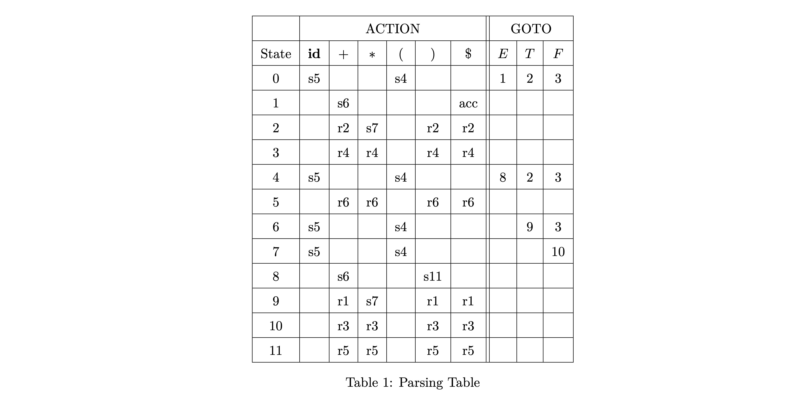

# $LR(0)$ 语法分析简介

$LR$ 分析器是一种**自底向上**的**上下文无关**语法分析器。$LR$ 意指由左 $(\mathrm{L,~left})$ 至右处理输入字符串，并以最右边优先派生 $\mathrm{(R,~right~derivation)}$ 的推导顺序（即构建**反向最右推导**）建构语法树。

$LR$ 分析器自底向上构建语法分析树，其中根节点是文法的起始符号 $S$；每个中间非终结符节点表示使用它的某条产生式进行归约；叶节点是词法单元流 $w\$$，即仅包含终结符号与特殊的文件结束符 $\$$。

::: warning $LR(k)$ 语法分析的优点

$LL(k)$ 的弱点: 

- 在仅看到右部的前 $k$ 个词法单元时就必须预测要使用哪条产生式。
  

$LR(k)$ 的优点: 
- 看到某个产生式的整个右部对应的词法单元之后再决定。
- 对所有“由左而右”扫描原始码的分析器而言，$LR$分析器可以在最短的时间内侦测到文法错误。

:::

# $LR(0)$ 语法分析流程与分析表

首先，在任意时刻，$LR(0)$ 语法分析器由**已生成的语法分析树上边缘**和**剩余的输入**构成。其中已生成的语法分析树上边缘用一个栈来维护，而剩余的输入用一个输入流缓冲区来维护。

## 一个简单的示例

下面是一个简单的 $LR(0)$ 语法分析示例，其产生式如下：

$$
\begin{matrix}
    (1)~&E \rightarrow E + T\\
    (2)~&E \rightarrow T\\
    (3)~&T \rightarrow T * F\\
    (4)~&T \rightarrow F\\
    (5)~&F \rightarrow (E)\\
    (6)~&F \rightarrow \mathbf{id}
\end{matrix}
$$

下图从左到右展示了一个简单的分析流程，其中**已生成的语法分析树上边缘**（即堆栈，左边为栈底，右边为栈顶）用红框标出，**剩余的输入**用蓝框标出。

可以看出，推导过程是

$$
\mathbf{id}*\mathbf{id} \rightarrow F * \mathbf{id} \rightarrow T * \mathbf{id} \rightarrow T * F \rightarrow T \rightarrow E
$$

这就是我们前面提到过的**反向最右推导**。

观察这一推导过程，我们还发现推导的两大基本操作为**移入输入符号**与**按产生式归约**。当栈中仅剩开始符号且输入结束（遇到$\$$）时，推导成功停止，语法树生成完毕。那么，针对这两大基本操作，我们引出了下面的问题：

- 何时移入？何时规约？
- 规约时按哪一产生式规约？

## 语法分析表

为了解决上述问题，我们引入了**语法分析表**。这是一个二维表，其中**行表示状态**，**列表示终结符与非终结符**。表中的每个元素是一个动作，控制了语法分析器的**移入**、**规约**、**状态转移**和**接受**等操作。

下面就是一个语法分析表的例子

其中，$\mathrm{ACTION}$ 表指明动作, $\mathrm{GOTO}$ 表仅用于归约时的状态转换。$\mathrm{ACTION}[i,a]$ 表示表中的第 $i$ 行上第 $a$ 列的元素，$\mathrm{GOTO}[i,a]$ 与之相同。表内具体的元素含义如下（为了方便，$\mathrm{GOTO}$ 表中的 $gn$ 都直接写作 $n$）：

由此，语法分析的初始状态从 $0$ 开始，按照语法分析表指导进行移入、规约、状态转移等操作，直至接受状态或发生错误。具体的流程可以用下面的伪代码表示：

语法分析流程伪代码.png)

到这里，似乎我们的两个问题就解决了。但是，我们又引出了一个新的问题：**如何构建这个语法分析表？**

# 句柄与句柄识别有穷状态自动机

在构建语法分析表之前，我们需要引入一个重要的概念：**句柄**。句柄是一个右部的前缀，可以在规约时被替换为左部。

::: tip 句柄的定义

在输入串的 (唯一) 反向最右推导中, 如果下一步是逆用产生式 $A \to \alpha$ 将 $\alpha$ 归约为 $A$, 则称 $\alpha$ 是当前句型的**句柄**。

:::

根据我们上文的伪代码，我们可以发现**句柄总是出现在栈顶**。因此，下面我们以此为目标来设计语法分析表。这就需要利用句柄识别有穷状态自动机$\mathrm{(Handle-Finding~Automaton)}$ 来完成。

## 句柄识别有穷状态自动机

下面是一个句柄识别有穷状态自动机的图示

这一状态机比较直观，但仔细看会发现状态机中的产生式中间被加了一个点。这其实是 $LR(0)$ 项的表示法。

::: tip $LR(0)$ 项的定义

文法 $G$ 的一个 $LR(0)$ 项是 $G$ 的某个产生式加上一个位于体部的点。点指示了栈顶, 左边 (与路径) 是栈中内容，右边是期望看到的文法符号串。

:::

此外，我们还会发现状态机中有一个非终结符 $E'$，这是为了方便处理文法的起始符号 $E$。$E'$ 是一个新的非终结符，其产生式为 $E' \to E$，并且 $E'$ 作为文法的新的起始符号。原先的文法增加了这个非终结符，成为了**增广文法**。

## 句柄识别有穷状态自动机构造

首先，我们从 $E \to \cdot E'$ 这一产生式开始构造，并使其为状态 $I_0$。我们要找出这一状态的所有产生式，即 $E \to \cdot E'$ 的闭包。我们有：

$$
\begin{matrix}
\mathrm{closure}(\{[E' \to \cdot E]\})=&\{[E \to \cdot E + T],\\ &[E \to \cdot T],\\ &[T \to \cdot T * F],\\ &[T \to \cdot F],\\ &[F \to \cdot (E)],\\  &[F \to \cdot \mathbf{id}]\}
\end{matrix}

$$

因此 $I_0$ 的项集为 $\mathrm{closure}(\{[E' \to \cdot E]\}) \cup [E' \to \cdot E]$。

接下来，我们要找出 $I_0$ 的转移条件。实际上，根据图示我们可以发现， $I_0$ 的转移条件就是其项集中点后面的符号。因此，我们可以得到 $I_0$ 的转移条件为 $\{E, T, F, (, \mathbf{id}\}$。

继续按此方法构造，我们可以得到整个句柄识别有穷状态自动机。最后，我们看到图中被**红色**标出的状态，这些状态是我们的**规约状态**。这一状态的特点是项集中存在一个项，其点在最右边，即可以进行规约操作。也就是说：**我们找到了句柄，并且它一定在栈顶**。那么下面我们把它转换为语法分析表即可。

## 由自动机构造语法分析表

那么，显然我们可以通过句柄识别有穷状态自动机来构造语法分析表。具体的构造法则如下：

- 如果由状态 $I_i$ 转为 $I_j$，且转移条件为 $a$ 为终结符，那么 $\mathrm{ACTION}[i, a]$ 为 $sj$。
- 如果由状态 $I_i$ 转为 $I_j$，且转移条件为 $A$ 为非终结符，那么 $\mathrm{GOTO}[i, a]$ 为 $gj$。
- 如果 $I_i$ 中存在 $A \to \alpha \cdot$ 且 $A \ne S'$，那么对于所有 $a \in T$，$\mathrm{ACTION}[i, a]$ 为 $rj$。（这里 $j$ 是 $A \to \alpha$ 的编号，$T$ 是所有终结符）
- 如果 $I_i$ 中存在 $S' \to S \cdot$，那么 $\mathrm{ACTION}[i, \$]$ 为 $acc$。

如果以上规则中没有冲突，那么这一文法是 $LR(0)$ **文法**。这里，$0$ 的含义就是**规约是不需要向前看，句柄一定在栈顶**。至此，我们完成了 $LR(0)$ 语法分析表的构造。